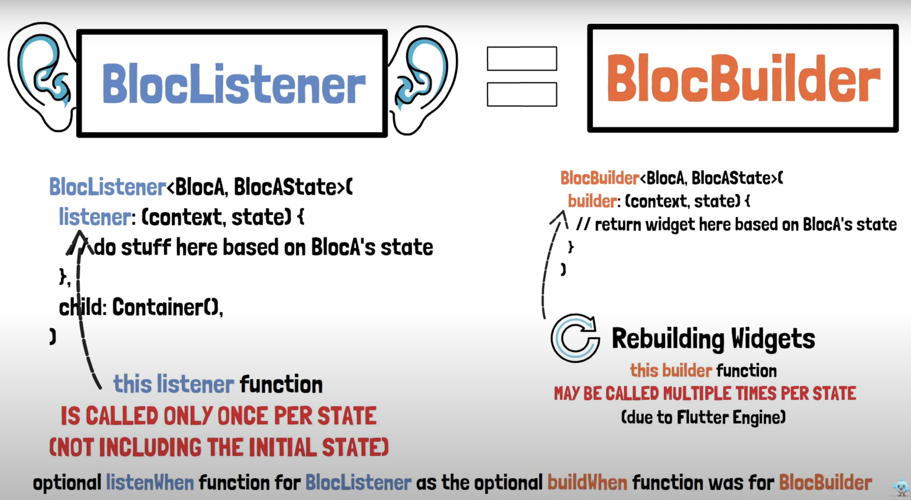
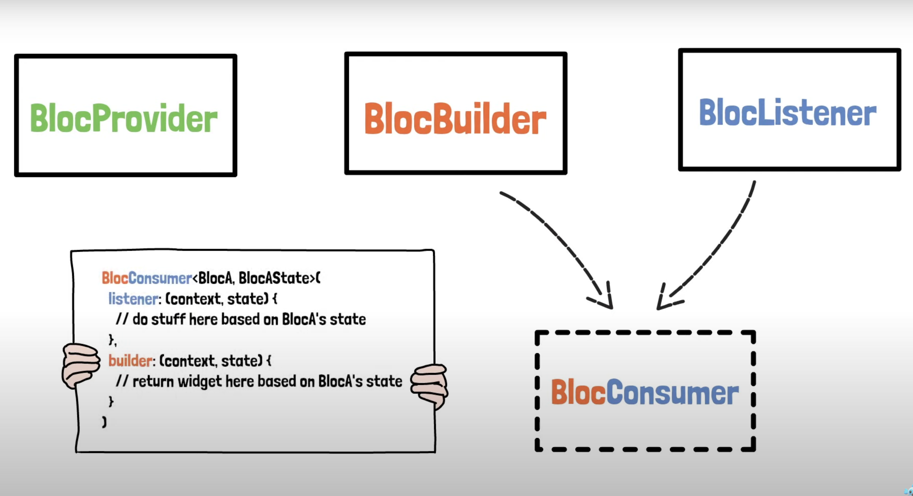
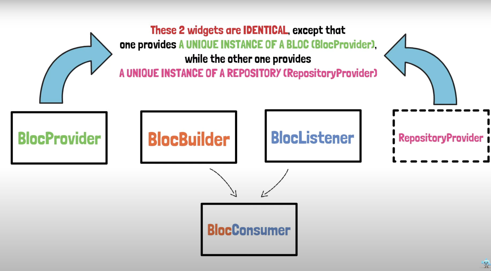
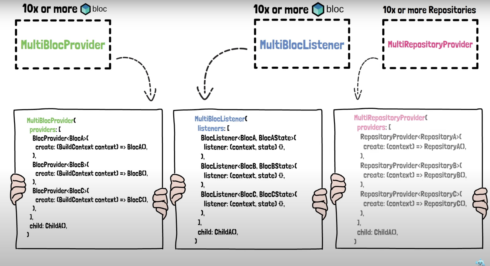

# hero_3_bloc_concepts

The Flutter project for #3 BLoC Concepts of the Bloc Zero-to-Hero course.

## Here is document all the takeaways i gathered in this chapter

### Bloc Provider
Hooks the UI up with the bloc / cubit. 
Here we wrap the whole MaterialApp with the BlocProvider widget, which enables the state of CounterState for the whole application

### Bloc Builder (builds a widget upon state change)
Receive new state in UI / update UI according to state change.
Wrap the UI element with this widget to be able to access the state. 
Magic component that builds the UI if new state is being emitted.
(we are the blocBuilder who are waiting for the boat)

BlocBuilder can be called multiple times due to the flutter engine

What about calling a SnackBar or navigating inside of a BlocBuilder? (with context)

### Bloc Listener (calls a function upon state change)
Does not build a widget, rather takes a void function.

### Bloc Consumer (combines builder and listener)
Combines the functionality of listener and builder in one single widget.
BlocConsumer should only be used when it is necessary to both rebuild UI and execute other reactions to state changes in the Bloc / Cubit.

### RepositoryProvider 
Not discussed thouroughly but very interesting. 
Will follow in a future course! (BLoC Architecture)
Is there to communicate with the backend, outter data layer (apis, database, etc).

### Screen Area

### Outlook
What if we have more than one BLoC we need to take care of? 
MULTI is the keyword here

