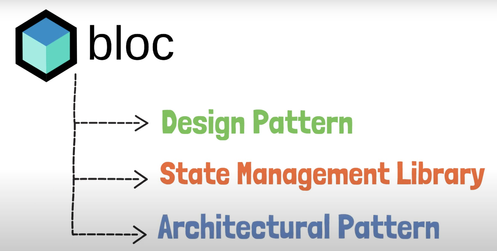
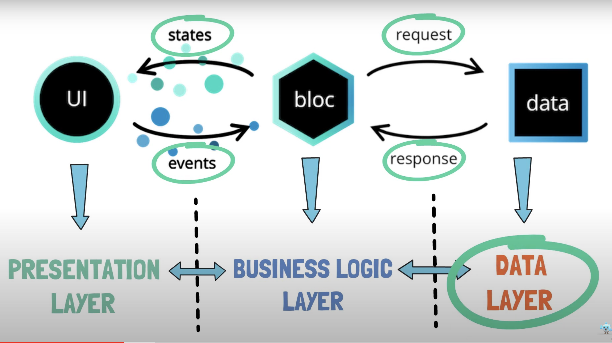
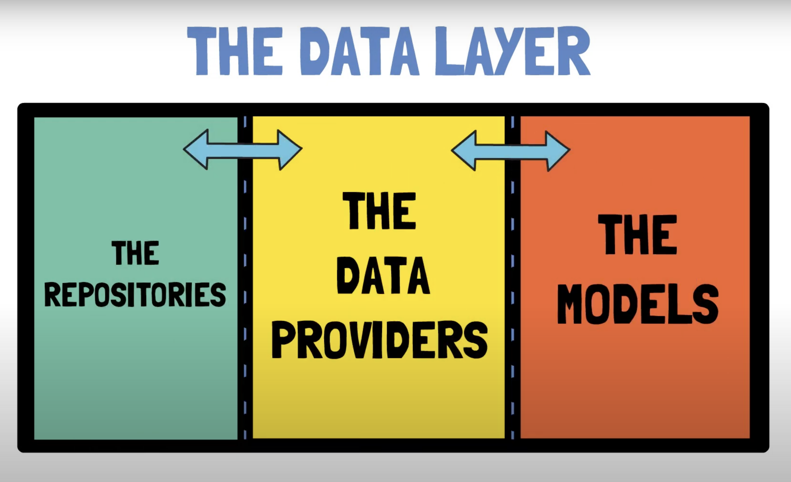
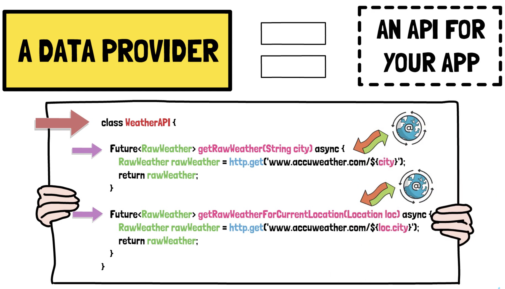
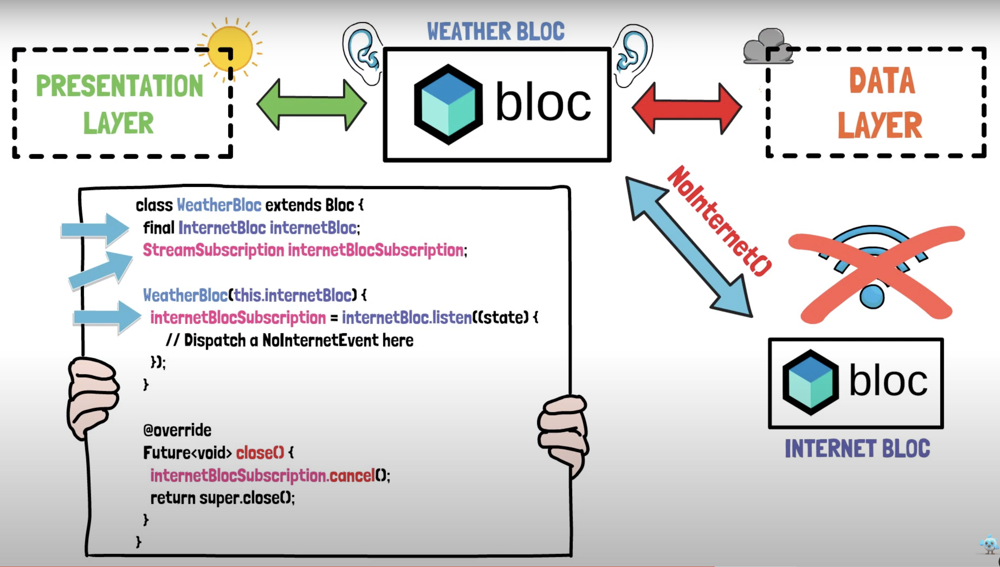
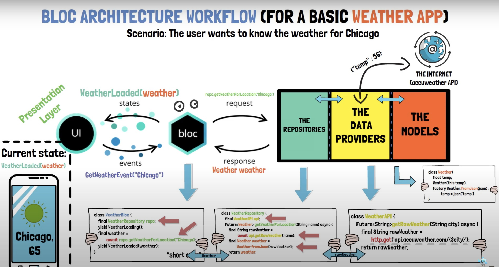

# hero_4_bloc_architecture

# 4 BLoC Architecture course 
Presentation, Business Logic & Data Layer + Model, Repository, DataProvider

## Data layer

### Model

Blueprints of data the application will work with.
The model should be independent enough to get model data also from different outter data layers
(for example different weather apis)

### Data Provider

API for the own application.
Directly execute the internet calls / endpoint calls.
Return type is not the model, it is the raw data fetched from the api endpoint.

### Repository
There are the models instantiated from the raw data (for example json)
Similar to a service but instead of directly calling the api endpoint we call the data provider which is our own api.
BLoC communicates with these classes.
Here we can also modify and re-fine the data before it is send to the business logic layer.

## Business logic layer

The BLoC itself, which is the middleman betwen the data and presentation layer

## Presentation layer

All the interactions and stuff which is going on in the UI

### Next

Build weather componentn while stealing from: https://www.youtube.com/watch?v=yfn1w2Z-Ooo 

## Screens

