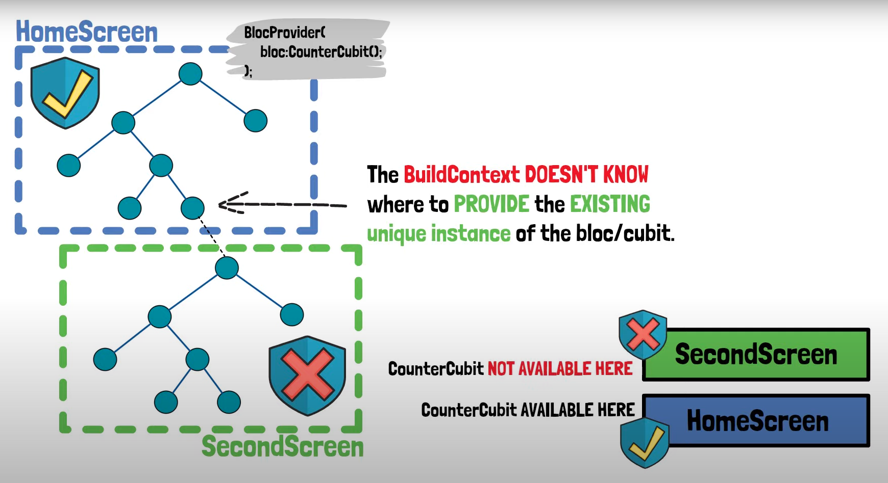
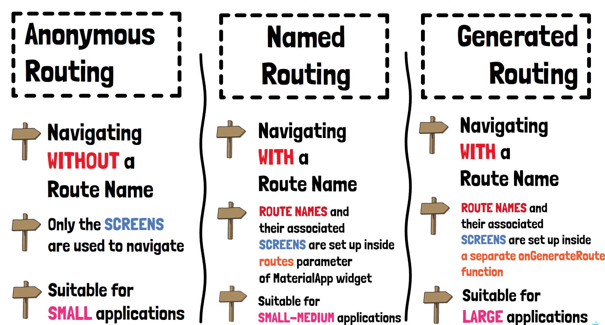
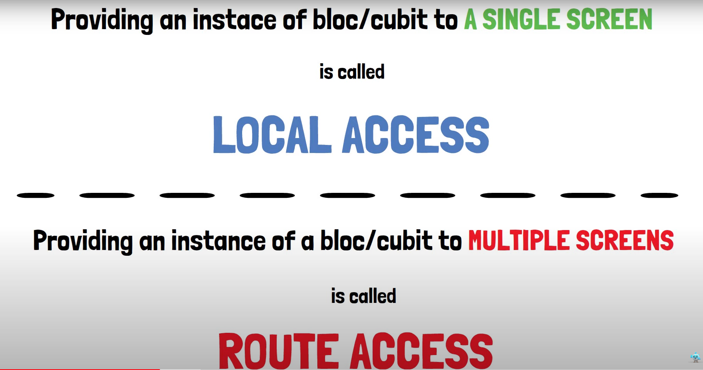

# hero_6_bloc_access_navigation

A new Flutter project that deals with the content for access and navigation

## Navigation problem with cubits

Therefore this is called local access, because only one screen (BuildContext) has access to that cubit and the provided functions that alter the state 

## Routing options and route access

 

## Important to know 

The home property in the Material App is pushed first in the navigation stack (default route)

"The widget for the default route of the app ([Navigator.defaultRouteName], which is /).
This is the route that is displayed first when the application is started normally, unless [initialRoute] is specified. It's also the route that's displayed if the [initialRoute] can't be displayed."