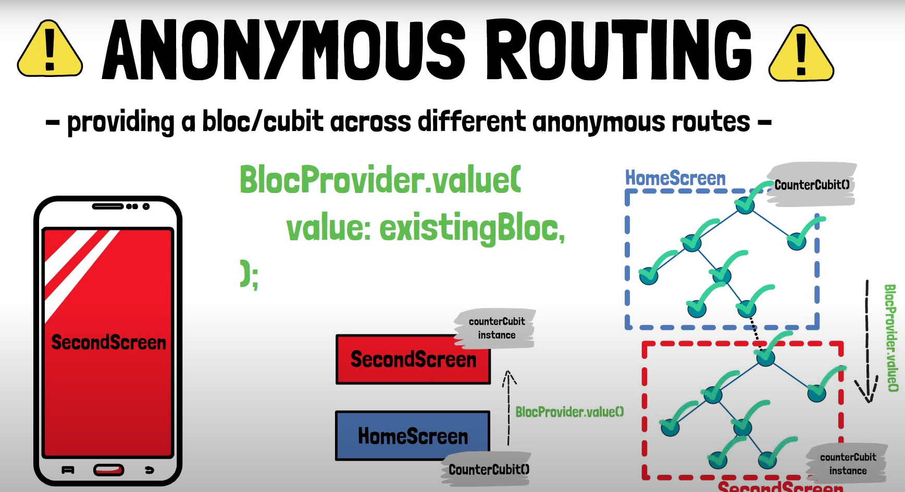
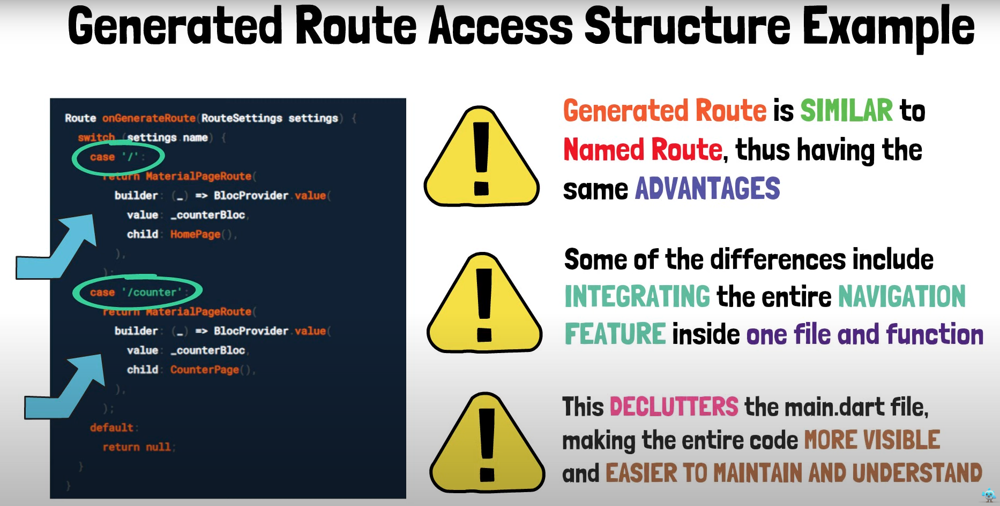
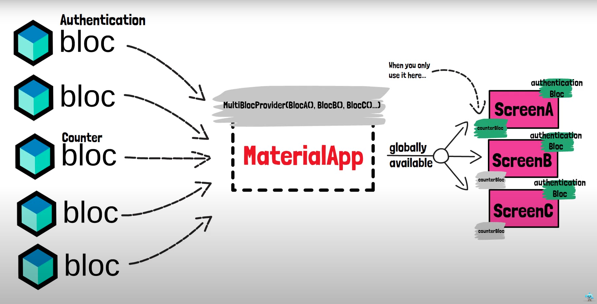
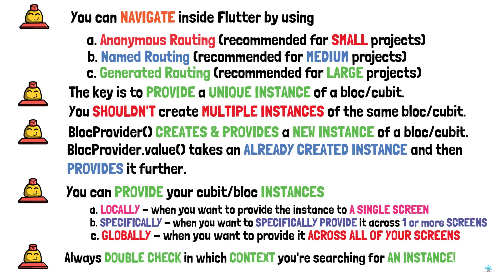

# hero_6_bloc_access_navigation

A new Flutter project that deals with the content for access and navigation

## Navigation problem with cubits

Therefore this is called local access, because only one screen (BuildContext) has access to that cubit and the provided functions that alter the state 

## Routing options and route access

 

### Anonymous Routing

Take the single cubit instance and pass it via the BlocProvider.value widget to another screen
(be careful about the context, the context of the home screen and not the new context need to be provided)

### Named Routing

Creating _instance in main app 
Establishing named routes which are wrapped in BlocProvider.value with this single instance as value
Dispose method in main needs to be triggered to close the cubit (stream)

Used popAndPushNamed to prevent back buttons

### Generated routing

Separate file which takes care of route settings.
OnGenerate Callback in main app that deals with routing (registered callback when pushNamedRoute is called, initial route should be '/')

 

How to provide the bloc instance (cubit) globally?
Wrap MaterialApp in BlocProvider (CounterCubit) to provide the countercubit globally..

## Important to know 

The home property in the Material App is pushed first in the navigation stack (default route)

"The widget for the default route of the app ([Navigator.defaultRouteName], which is /).
This is the route that is displayed first when the application is started normally, unless [initialRoute] is specified. It's also the route that's displayed if the [initialRoute] can't be displayed."

Globally providing blocs for all screens? (will be tackled in future videos)

## Final slides of lecturing video

