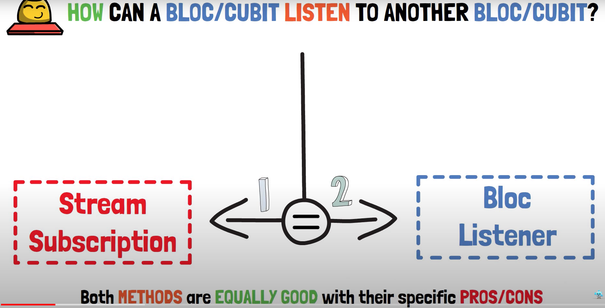

# hero_7_bloc_to_bloc_communication

A new Flutter project that deals with the content for bloc to bloc communication.

Coding example deals with an additional bloc (InternetBloc) upon specific states (e.g WiFiON state) the counter function will be executed (cubit)

## Introduction Bloc-to-Bloc communication

There are two possibilities: 
- StreamSubscribtion (as we know from streams) -> manually opening and closing
- BlocListener

## Goal of this tutorial 

Whenever the phone is connected to Wi-Fi -> increment 
Whenever the phone is connected to mobile -> decrement

