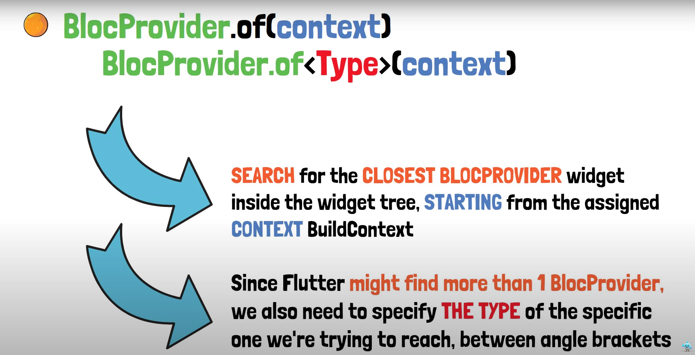
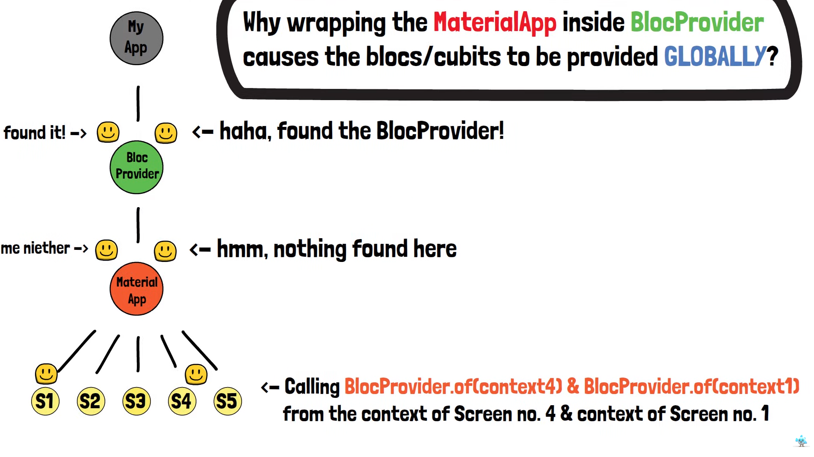
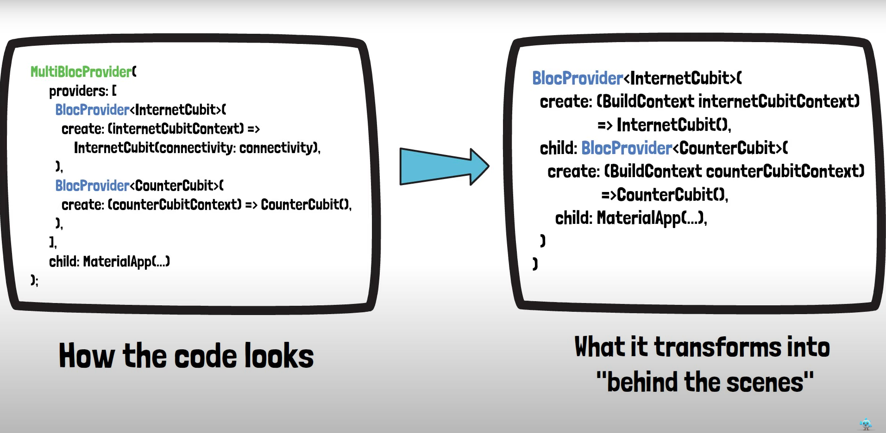
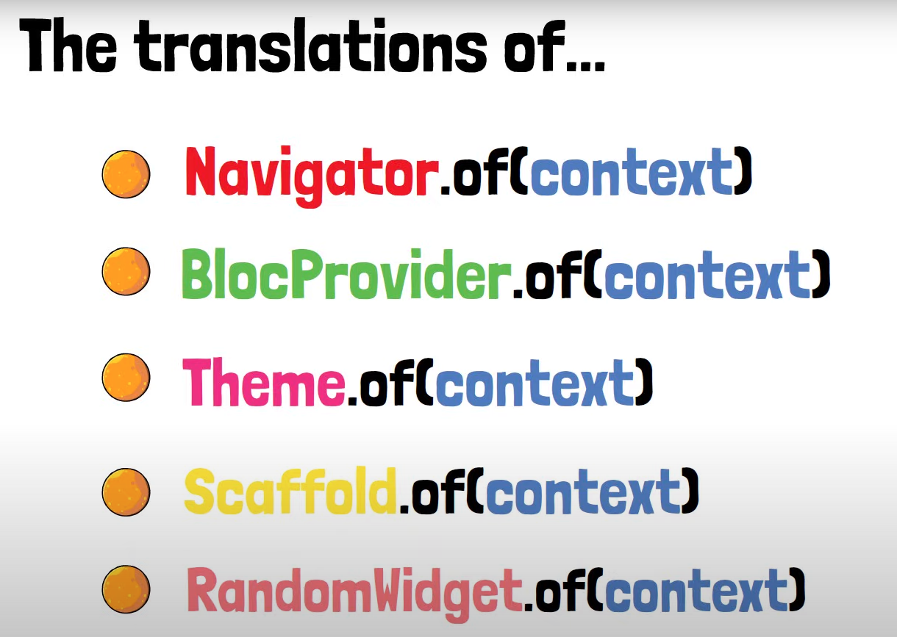

# hero_7_bloc_to_bloc_communication

A new Flutter project that deals with the content in-depth build context analysis

## Lessons Learned from watching content

Different context for different widgets 

Bottom-Up approach

Every widget has basically two / maybe three context options
- Build Context with their build method 
- anonymous context (e.g text widget or raised button etc.)

If a new screen is pushed the navigator context is being searched 
- this is always a bottom-up approach 
- navigator context is always in the material app
- screen is therefore pushed as a child from material app (e.g second screen)

Widget tree analysis very important (how is my app build in the end)

# BlocProvider.of(context), BlocProvider.of<Type>(context)

Always remember bottom-Up methodology

# Multi BloC provider composition

These translations are all pretty much the same (from a context search perspective)

